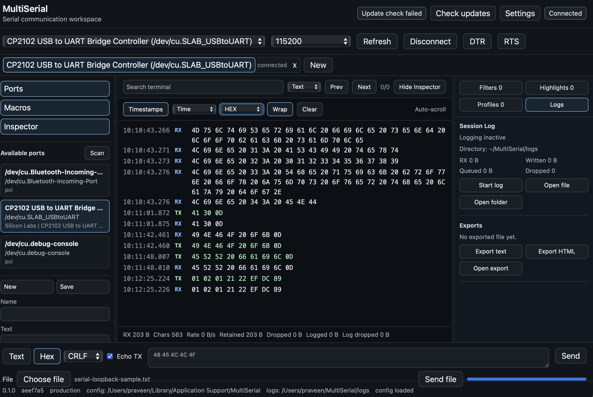
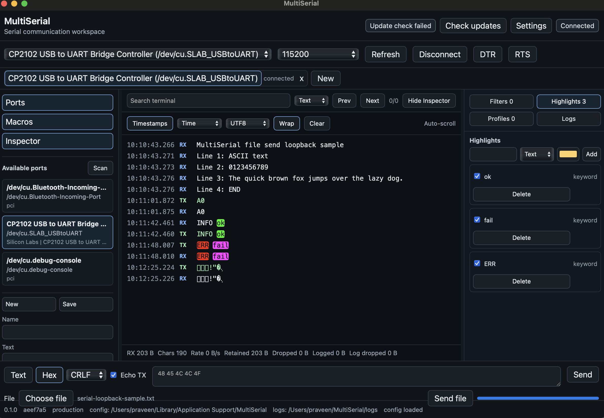
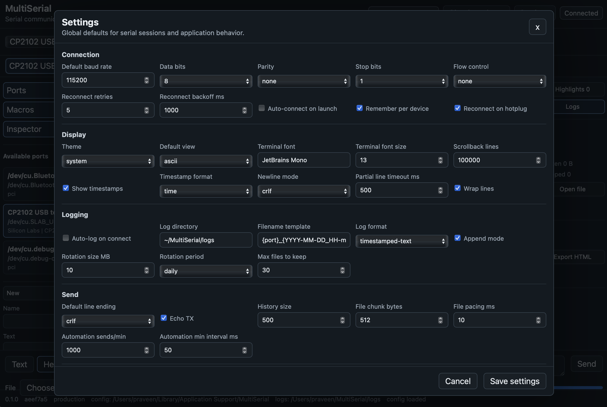

# MultiSerial

MultiSerial is a desktop serial communication workspace for connecting to UART, USB-serial, and COM-port devices. It is built with Tauri 2, Rust, React, and TypeScript, with the serial backend running natively through Rust and the UI focused on day-to-day device bring-up, loopback checks, logging, and repeatable send workflows.

The app is intended for embedded, hardware, firmware, and lab workflows where you need to inspect incoming serial data, send text or bytes, keep logs, and switch between devices without relying on a terminal-only tool.



## What You Can Do

- Discover serial ports and inspect USB metadata such as product, manufacturer, VID/PID, and serial number.
- Connect with configurable baud rate, data bits, parity, stop bits, and flow control.
- Send text, hex bytes, macros, automated sends, and raw file contents.
- View terminal data as UTF-8, hex, binary, decimal, or mixed output.
- Search terminal data, add filters, and highlight matching patterns.
- Keep independent session tabs with separate buffers, settings, filters, macros, and logs.
- Start session logs, open log folders, and export terminal data as text or HTML.
- Toggle DTR and RTS while connected.



## Current Status

The project is under active implementation. The macOS path is the most heavily exercised so far, including CP2102 loopback testing. Windows and Linux support are part of the project scope, but cross-OS packaging and hardware validation still require native host testing.

Known current release gates are tracked in [TODO.md](TODO.md), with hardware spike results in [docs/spike-results.md](docs/spike-results.md).

## Quick Start For Development

Use the pinned project toolchain rather than global JavaScript tooling:

```bash
corepack enable
corepack prepare pnpm@10.11.0 --activate
corepack pnpm install
corepack pnpm tauri:dev
```

Development runs use isolated project-local data under `.dev-data/` for config, logs, temp files, and test results. This avoids clashing with the computer's global environment or production app data.

For the browser-only preview:

```bash
corepack pnpm dev
```

For a production frontend build:

```bash
corepack pnpm build
```

For the packaged desktop app:

```bash
corepack pnpm tauri:build
```

More setup detail is in [docs/development.md](docs/development.md).

## Manual Loopback Test

1. Connect a USB-to-TTL serial adapter.
2. Short TX to RX on the adapter.
3. Launch MultiSerial and scan ports.
4. Select the adapter, choose a baud rate such as `115200`, and click Connect.
5. Send text such as `hello` and confirm it appears back in the terminal.
6. Switch to Hex and send bytes such as `00 01 02 ff`.

A sample file for file-send testing is included at:

[docs/samples/serial-loopback-sample.txt](docs/samples/serial-loopback-sample.txt)

Use `Choose file`, select the sample file, connect a loopback adapter, and click `Send file`. File send transmits the file's raw bytes over the active serial connection.

## Settings

The Settings dialog controls default connection parameters, display behavior, logging, send/file pacing, automation limits, filters, update behavior, and privacy defaults.



Production logs default to `~/MultiSerial/logs`. Development and tests use `.dev-data/` paths.

## Test Commands

Run the main checks before committing:

```bash
corepack pnpm typecheck
corepack pnpm lint
corepack pnpm format:check
corepack pnpm test
corepack pnpm test:e2e
corepack pnpm rust:fmt
corepack pnpm rust:test
corepack pnpm rust:clippy
```

Hardware loopback tests are ignored by default because they require a physical adapter. See [docs/hardware-self-test.md](docs/hardware-self-test.md).

## Useful Docs

- [Quick Start](docs/quick-start.md)
- [Serial Connection Guide](docs/serial-connections.md)
- [Logging](docs/logging.md)
- [Linux Permissions](docs/linux-permissions.md)
- [Privacy](docs/privacy.md)
- [Release Checklist](docs/release-checklist.md)
- [Architecture Decisions](docs/architecture-decisions.md)

## Repository Layout

- `src/` - React frontend, terminal model, send/macro logic, filters, settings, and app state.
- `src-tauri/` - Rust Tauri shell, serial backend, logging backend, config, and native commands.
- `tests/e2e/` - Playwright workflows for UI behavior and browser mock serial testing.
- `docs/` - user, developer, hardware, and release documentation.
- `.dev-data/` - local development/test data and manual test files.

## License

This project is licensed under the terms in [LICENSE](LICENSE). Third-party notices are collected in [THIRD_PARTY_NOTICES.md](THIRD_PARTY_NOTICES.md).
